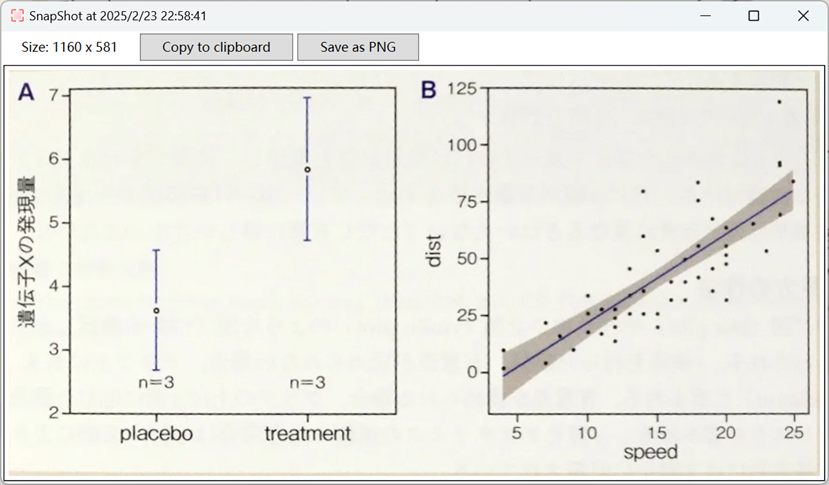

## 目次
- [概要](#概要)
  - [既存アプリとの比較](#既存アプリとの比較)
  - [用途](#用途)
- [特徴](#特徴)
- [ビルド](#ビルド)
  - [リリース](#リリース)

# 概要
本ソフトウェアは、PC上でスクリーンショットを取得し、選択範囲の角度を360度自由に回転できるWPFベースのデスクトップアプリケーションです。直感的な操作でスクリーンショットの編集を行うことができます。

## 既存アプリとの比較


ピサの斜塔の写真を切り取る例を用いて、既存アプリとの比較を通じて、本アプリのメリットをご紹介いたします。
|  | 既存アプリ | 本アプリ |
|------|:------:|:------:|
| 操作 | 長方形の範囲しか選択できません</br> | 長方形の範囲を選択し、回転・調整することができます</br>  |
| 結果 | 斜めに切り取られてしまいます</br> | 正しい位置で切り取ることができます</br> |


## 用途
例えば、下記のウェブページに斜めな図表があるとします、この図表をまっすぐに表示した状態でスクリーンショットするには、どうすればよいでしょうか？

本ソフトウェアを使えば、不要な部分を含めずに、図表だけをぴったり選択してスクリーンショットできます。


結果は下記のように表示されます、クリップボードにコピーしたり、PNGファイルとして保存したりすることが可能です。



</br>

# 特徴
- スクリーンショットの取得（マルチスクリーン対応）

- 選択範囲の編集（サイズ調整・360度回転）

- 画像の保存（PNG形式）及びクリップボードコピー

</br>

# 動作環境
- 対応OS: Windows 10 / 11
- 開発環境: .NET 8 以上 / C#（WPF）

</br>

# ビルド
プロジェクトのフォルダーで、以下のコマンドを実行します。

```dotnet run```

## リリース
win-x64プラットフォームを例にすると、リリース用のコマンドは以下のとおりです。
 
```dotnet publish -r win-x64 -c Release /p:PublishSingleFile=true /p:SelfContained=true```