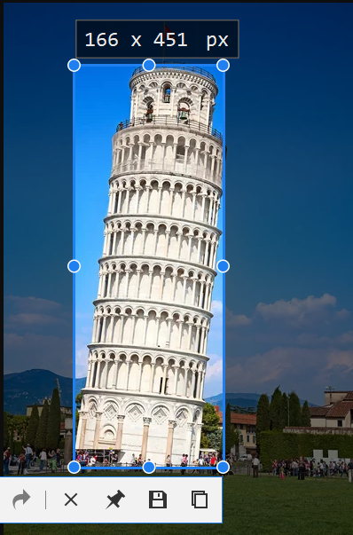
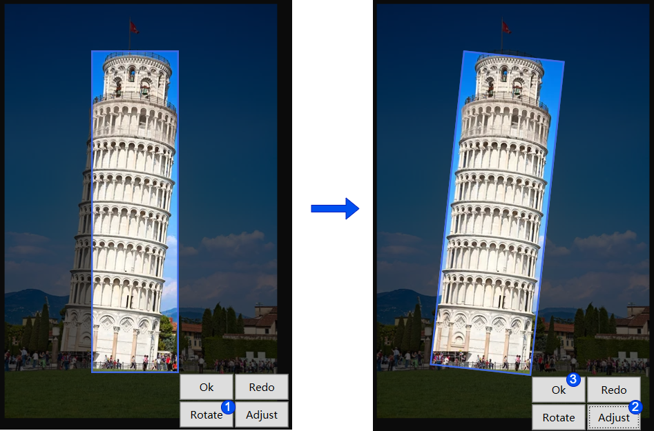
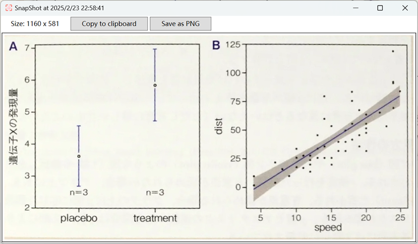

🌸[日本語のREADMEはこちら](./README.ja.md)

## Table of Contents
- [Overview](#overview)  
  - [Comparison with Existing Applications](#comparison-with-existing-applications)  
  - [Use Cases](#use-cases)  
- [Features](#features)  
- [Build](#build)  
  - [Release](#release)

# Overview
This software is a WPF-based desktop application that allows users to take screenshots on a PC and freely rotate the selected area at any angle (360 degrees). It enables intuitive editing of screenshots.

## Comparison with Existing Applications


Using an example of cropping a photo of the Leaning Tower of Pisa, we will illustrate the advantages of this application over existing ones.

|  | Existing Applications | This Application |
|------|:------:|:------:|
| Operation | Can only select rectangular areas</br> | Allows selection of rectangular areas and enables rotation/adjustment</br>  |
| Result | Cropped at an angle</br> | Can be cropped at the correct angle</br> |

## Use Cases
Suppose a web page contains a diagram that appears tilted. How can you capture a screenshot of this diagram in a straightened form?

With this software, you can accurately select only the desired diagram—excluding unnecessary areas—and capture it as a clean screenshot.


The result will be displayed as shown below. You can copy it to the clipboard or save it as a PNG file.



</br>

# Features
- Capture screenshots (multi-monitor support)  
- Edit selected areas (resize and 360-degree rotation)  
- Save images (PNG format) and copy to clipboard  

</br>

# System Requirements
- Supported OS: Windows 10 / 11  
- Development Environment: .NET 8 or later / C# (WPF)

</br>

# Build
Run the following command in the project folder:

```bash
dotnet run
```

# Release
To publish for the win-x64 platform, use the following command:
```bash
dotnet publish -r win-x64 -c Release /p:PublishSingleFile=true /p:SelfContained=true
```